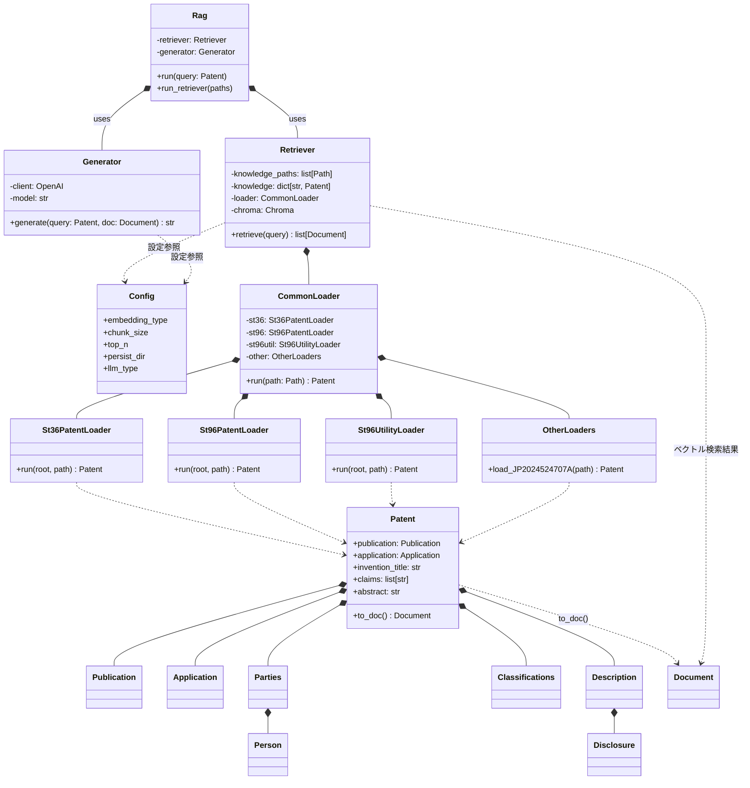

## 実行手順

### zipを解凍
任意のディレクトリにZIPファイル（ソースコード一式）を解凍してください。

### uvをインストール
以下のコマンドを実行して、uvをインストールしてください。（インストール済なら、スキップしてください。）

```bash
# macOS/Linux
curl -LsSf https://astral.sh/uv/install.sh | sh

# Windows
powershell -ExecutionPolicy ByPass -c "irm https://astral.sh/uv/install.ps1 | iex"
```

### サンプルコードを実行
sample.pyがあるディレクトリに移動して、以下のコマンドを実行してください。

```bash
uv run sample.py
```

自動的に、必要なライブラリのインストール、仮想環境の構築、.pyファイルの実行が行われます（1~3分）。標準出力に何かメッセージが表示されたらOKです。

### APIキーの設定
環境変数`OPENAI_API_KEY`にOpenAIのAPIキーを設定してください。

### XMLローダ単体の実行
VSCodeで解凍したプロジェクトフォルダを開く。
`src\infra\loader\common_loader.py` を開いて、F5キーでデバッグ実行する。

### RAG実行
`src\main.py` を開いて、F5キーでデバッグ実行する。
または、コマンドラインから実行する。
```bash
uv run src/main.py
```

### GUI起動
```bash
uv run streamlit run src/gui.py
```

### デバッグ
VSCodeのデバッガを使用したデバッグ方法については、**[DEBUG.md](DEBUG.md)** を参照してください。
- UI連携のデバッグ（Streamlitアプリ全体）
- ロジック単体のデバッグ（RetrieverやGenerator）
の両方をサポートしています。

---

## ディレクトリ構成

最新構成（主要ファイル / 代表例のみ。大量データ配下は一部省略）
```
GENIAC04/
├─ README.md                      # このファイル
├─ DEBUG.md                       # デバッグガイド
├─ debug_retriever.py             # 検索ロジック単体デバッグ用
├─ debug_generator.py             # 生成ロジック単体デバッグ用
├─ pyproject.toml                 # uv パッケージ管理
├─ uv.lock                        # uv ロックファイル
├─ sample.py                      # 初回動作確認用（uv run sample.py）
├─ .python-version                # Python バージョン固定（pyenv 等）
├─ data/                          # 特許/実用新案 XML（ナレッジ & 評価用）
│  ├─ result_1/ ...               # 公開特許Aなど（多数の階層 & text.txt）
│  ├─ result_18/ ...              # 実用新案/登録特許等混在
│  └─ gui/                        # GUI入力用（uploaded_query.txt 等）
├─ data_store/                    # ベクトルDB永続化領域
│  ├─ chroma/
│  │  ├─ v0.1/                    # バージョン別 永続ディレクトリ例
│  │  └─ ...                      # gemini_v0.1 / openai_v1.0 など
│  └─ faiss/                      # （将来）Faiss用格納場所
├─ eval/                          # 評価関連
│  ├─ eval.ipynb                  # 評価ノートブック
│  ├─ rag_output.csv              # RAG 出力結果
│  ├─ rag_output_with_TF.csv      # TF等付加情報付き結果
│  ├─ knowledge/                  # 評価用ナレッジ抽出結果
│  └─ query/                      # 評価用クエリ特許
├─ doc/
│  └─ README_旧.md                # 旧 README（履歴）
├─ src/
│  ├─ main.py                     # RAG 実行エントリポイント
│  ├─ gui.py                      # Streamlit GUI 起動用
│  ├─ app/                        # アプリケーション層（ユースケース）
│  │  ├─ retriever.py             # 検索器（埋め込み + ベクトル検索）
│  │  ├─ rag.py                   # RAG オーケストレーション
│  │  └─ generator.py             # 回答/理由生成（実装進行中）
│  ├─ infra/                      # 外部I/O・設定層
│  │  ├─ config.py                # 設定値（cfg）
│  │  └─ loader/                  # XML ローダ群
│  │     ├─ common_loader.py      # XML種別判定→適切ローダ委譲
│  │     ├─ loader_utils.py       # ロード共通ヘルパ
│  │     ├─ other_loader.py       # 特殊ケース個別対応
│  │     ├─ st36_patent_loader.py # ST36 特許ローダ
│  │     ├─ st96_patent_loader.py # ST96 特許ローダ（A/B/PCT）
│  │     └─ st96_utility_loader.py# ST96 実用新案ローダ
│  ├─ model/                      # ドメインモデル
│  │  └─ patent.py                # Patentデータモデル
│  └─ ui/                         # （将来）UI層共通部品
│     ├─ cli/                     # CLIインターフェース試作
│     │  └─ cli1.py
│     └─ gui/                     # GUI ページ分割
│        ├─ page1.py
│        ├─ page2.py
│        ├─ page99.py             # テスト/検証用ページ
│        └─ utils.py              # GUIユーティリティ
```

（補足）
* ベクトルDBは `cfg.persist_dir` で指定するディレクトリ（例: data_store/chroma/...）に永続化。
* `generator.py` は今後の実装拡張対象（理由生成/回答生成）。
* 大量の `data/result_*` 配下は評価・検証用コーパスで一部のみ表示。

---

## クラス図 (src 配下)

Mermaid形式で、主要クラスと依存関係（合成 *-- / 集約 o-- / 利用 ..>）を示します。
メソッド欄には、基本的にはPublicメソッドのみを記載（Privateメソッドは省略）


