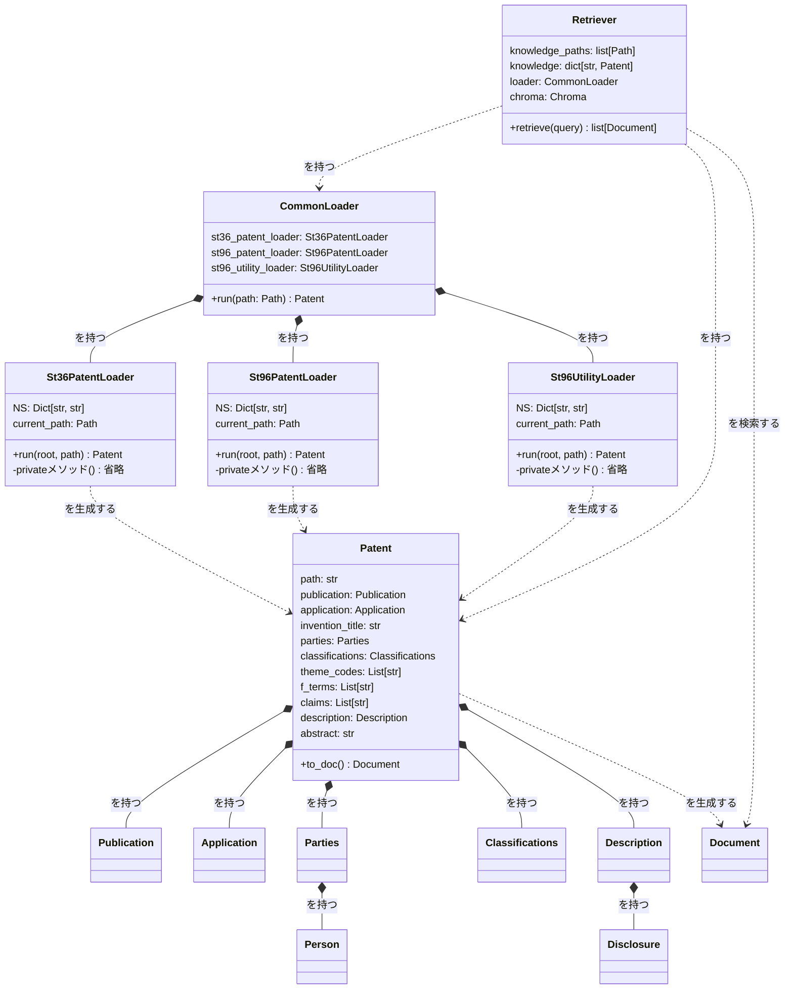

## 実行手順

### zipを解凍
任意のディレクトリにZIPファイル（ソースコード一式）を解凍してください。

### uvをインストール
以下のコマンドを実行して、uvをインストールしてください。（インストール済なら、スキップしてください。）

```bash
# macOS/Linux
curl -LsSf https://astral.sh/uv/install.sh | sh

# Windows
powershell -ExecutionPolicy ByPass -c "irm https://astral.sh/uv/install.ps1 | iex"
```

### サンプルコードを実行
sample.pyがあるディレクトリに移動して、以下のコマンドを実行してください。

```bash
uv run sample.py
```

自動的に、必要なライブラリのインストール、仮想環境の構築、.pyファイルの実行が行われます（1~3分）。標準出力に何かメッセージが表示されたらOKです。

### APIキーの設定
環境変数`OPENAI_API_KEY`にOpenAIのAPIキーを設定してください。

### XMLローダ単体の実行
VSCodeで解凍したプロジェクトフォルダを開く。
`src\infra\common_loader.py` を開いて、F5キーでデバッグ実行する。
動作の詳細は、ステップイン実行（F11キー）で確認してください。

### RAG実行
`src\app\rag_controller.py` を開いて、F5キーでデバッグ実行する。
動作の詳細は、ステップイン実行（F11キー）で確認してください。

---

## ディレクトリ構成

```
GENIAC04/   
├─ README.md
├─ pyproject.toml            # uvパッケージ管理用
├─ uv.lock                   # uvパッケージ管理用
├─ sample.py                 # uv環境構築・初回動作確認用
├─ data/                     # ナレッジ/評価用データ（XML形式の特許文献）
├─ data_store/               # DB関連（ベクトルDB、RDBなど）
│  ├─ chroma/
│  └─ faiss/
├─ eval/                     # 評価用スクリプト・結果CSV
├─ scripts/                  # 補助スクリプト / 変換ツール
├─ src/
│  ├─ main.py                # エントリポイント（未実装）
│  ├─ app/
│  │  ├─ retriever.py        # 検索器（ベクトルDB構築 + 検索）
│  │  ├─ rag_controller.py   # RAG全体制御（今は検索のみ）
│  │  └─ generator.py        # 回答生成器（未実装）
│  ├─ infra/
│  │  ├─ common_loader.py           # XMLローダのエントリポイント（適切なローダに委譲）
│  │  ├─ loader_utils.py            # XMLローダが使うヘルパー関数
│  │  ├─ st36_patent_loader.py      # ST36形式の特許ローダ
│  │  ├─ st96_patent_loader.py      # ST96形式の特許ローダ
│  │  └─ st96_utility_loader.py     # ST96形式の実用新案ローダ
│  └─ model/
│     └─ patent.py           # 特許関連データモデル
└─ tmp/                      # 一時ファイル
```

---

## クラス図 (src 配下)

Mermaid形式で、主要クラスと依存関係（合成 *-- / 集約 o-- / 利用 ..>）を示します。
メソッド欄には、基本的にはPublicメソッドのみを記載（Privateメソッドは省略）


